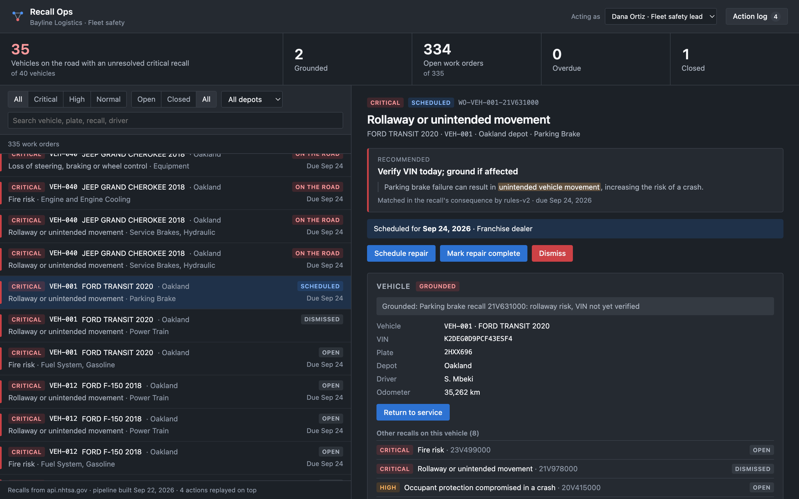

# Recall Ops

[](https://github.com/qasimmurad/recall-ops/actions/workflows/ci.yml)

A Foundry-style operational app for a fleet safety team. Real NHTSA recall data goes in, an ontology defines the objects, links and actions, and people make decisions in the app. Every decision is validated, permissioned and audited.

**[Try the live demo →](https://qasimmurad.github.io/recall-ops/)** It runs in your browser, with nothing to install.



## The problem

Bayline Logistics (fictional) runs 40 vans, pickups and SUVs out of four depots. Recalls reach them the way they reach most fleets: a manufacturer letter, a news story, an email. Someone cross-references the fleet spreadsheet, emails the depot managers, and tracks fixes in a second spreadsheet.

Nobody can answer the question that matters: **which of our vehicles are on the road right now with an unresolved safety recall, and who is dealing with each one?** The data exists. The loop from data to decision to record doesn't.

## What it does

- Pulls every recall NHTSA has published for each make, model and year in the fleet: 87 records covering 79 campaigns.
- Reconciles the messy roster with NHTSA's vocabulary ("Chevy" → `CHEVROLET`, "ProMaster 1500" → `PROMASTER`).
- Triages each recall by how the harm happens, and opens one work order per vehicle per recall (335 in all).
- Gives the safety team one inbox, sorted by what is dangerous now, with five actions: ground a vehicle, return it to service, schedule a repair, mark it complete, and dismiss with evidence.
- Enforces rules where the write happens. A vehicle can't return to service while a critical recall on it is open. Only the safety lead can dismiss a recall, and only with a reason and evidence.
- Records every action: who, when, and the before and after of every property it changed.

## How it maps to Foundry

| This repo | Foundry equivalent |
|---|---|
| `data/raw/*.json` and `_manifest.json` | Raw datasets from a Data Connection sync |
| `src/normalize.py`, `src/pipeline.py` | Pipeline Builder or Python transforms |
| `ontology/ontology.json` | Ontology Manager: object types, link types, action types |
| `src/kernel.py` | Actions, submission criteria, writeback and the action log |
| `src/triage.py` | An AIP Logic function (rules for now, not an LLM) |
| `src/views.py` | Derived properties and Workshop variables |
| `web/index.html` | A Workshop module |
| `web/kernel.js` | The same kernel in the browser, for the live demo |

## Design decisions

**1. Human decisions live apart from pipeline output.** The pipeline rebuilds `state/objects.json` from source data on every run. Actions append to `state/edits.jsonl`, and the kernel replays that log on top whenever it loads. Rebuilding the data, even while the app is running, never erases a decision. If a rebuild removes an object that an edit touched, the edit is kept and reported as orphaned rather than silently dropped. If the process dies mid-append, the torn last line is set aside and everything before it loads; damage anywhere else stops the kernel, because deciding which human decisions to keep isn't its call.

**2. The ontology is data, and the kernel is generic.** `kernel.py` knows nothing about vehicles. Parameter types, who may submit, submission criteria and edits are all declared in `ontology.json`. The UI builds its forms from the same file and leaves validation to the kernel, so the rules live in one place. An action that uses the supported parameter, criterion and edit types is a JSON change, not a code change. New kinds of edit, such as creating or deleting objects, would extend the kernel once.

**3. The obvious signal was empty.** NHTSA publishes a do-not-drive flag (`parkIt`) and a park-outside flag. None of the 79 campaigns affecting this fleet set either one, and 53 of the 79 consequences mention a "risk of a crash", so neither separates much. The triage reads the mechanism instead: fire, rollaway, loss of control, stalling, occupant protection. The rules assign a mechanism to 78 of the 79. The one they miss, 18V214000, says "the vehicle may roll" instead of "rollaway", which is the argument for putting an LLM behind the same interface. Until then it fails safe: anything unclassified is marked high priority for a person to read within a day, never filed as normal. Defects in a label rather than a part are capped at normal priority, with the reason shown.

**4. The honest first answer is uncomfortable.** On day one, 37 of 40 vehicles show an unresolved critical recall. NHTSA's API matches on make, model and year, but each campaign only covers a range of VINs. Grounding 37 vehicles isn't a real option, so critical recalls recommend "Verify VIN today; ground if affected", and dismissing with evidence ("VIN outside the recall's affected range") is a first-class action rather than a workaround.

**5. Ingestion fails closed.** For a safety tool, "we couldn't reach NHTSA" must never look like "this vehicle has no recalls". The fetcher stages every response and replaces `data/raw/` only if every request succeeded. The pipeline stops, writing nothing, if any vehicle type in the roster has no response. A roster row with an unrecognized status is treated as in service, since the safe assumption is that the vehicle is on the road.

**6. Every object can say where it came from.** Vehicles point to their CSV row and show the spelling that was typed. Recalls point to the exact JSON file and record, and when it was fetched. Work orders record the rule that created them. Priorities record the phrase that triggered them. The date each work order was first opened lives in a ledger the pipeline only adds to, so a rebuild never makes an old recall look new.

## Run it

The [live demo](https://qasimmurad.github.io/recall-ops/) is the quickest way in. GitHub Pages can't run Python, so the demo runs `web/kernel.js`, a JavaScript port of the kernel, over a snapshot of the pipeline output. `tests/test_parity.py` sends the same 37 steps through both kernels and fails if they differ on any edit, error message or final state. Actions in the demo are saved in your browser only, and its dates are shifted so the data always looks freshly built.

To run the real thing locally you need Python 3.9 or later, standard library only (Node.js is used only by the parity test):

```bash
python3 src/make_fleet.py       # synthetic roster -> data/fleet.csv
python3 src/fetch_recalls.py    # optional: refresh data/raw/ from NHTSA (already included; needs network)
python3 src/pipeline.py         # -> state/
python3 src/server.py           # http://localhost:8765
python3 -m unittest discover -s tests
python3 src/build_demo.py       # the static demo -> site/
```

To clear every action, delete `state/edits.jsonl`. A running server notices and starts over.

Every push runs the tests on Python 3.9 and the latest release. If they pass, GitHub Actions rebuilds the data and deploys the demo (`.github/workflows/ci.yml`).

Things to try:

1. Click the red headline number: every open critical work order on a vehicle that is still on the road.
2. Ground a vehicle, then try **Return to service**. The kernel blocks it and names the work orders in the way.
3. Switch "Acting as" to Sam Reyes, a depot manager, and look at **Dismiss**.
4. With the app open, run `python3 src/pipeline.py` again and refresh. Every decision survives.

## Limitations and next steps

- **Unverified versus confirmed.** Today a work order is open until someone closes it, so "37 of 40" mixes confirmed hazards with unchecked matches. Next: an applicability state on each work order (unverified, affected, not affected), a verify-VIN action, and a headline that separates the two. With real VINs, a per-VIN recall lookup would make most of those checks automatic. The roster's VINs are synthetic.
- **LLM triage.** Put an LLM behind `triage.assess()` with the same output shape, hand-label the 79 real campaigns as a test set, and measure both approaches against it before trusting either.
- **Identity.** Roles are whatever the client says they are. In Foundry they come from the platform's users, groups and permissions.
- **One writer.** The kernel assumes a single server process writes the log. More than one would need a lock or a database.
- **Two kernels.** The live demo runs a JavaScript port of the Python kernel. The parity test keeps them in step, but a real deployment would have one implementation behind an API.
- **Scheduled sync.** Fetch nightly, diff against the previous run, and alert when a new recall hits a vehicle.
- **Port to Foundry.** Upload `data/`, rebuild the pipeline in Pipeline Builder, recreate the three object types and five actions in Ontology Manager, and build the inbox in Workshop.

## Data and license

- **Recalls:** the NHTSA Recalls API (`api.nhtsa.gov/recalls/recallsByVehicle`), fetched 2026-09-21. Raw responses are committed in `data/raw/`. NHTSA data is a US government work; its use here doesn't imply NHTSA endorsement.
- **Fleet:** synthetic, generated by `src/make_fleet.py` with a fixed seed. Names, VINs and plates are made up.
- **Code:** MIT, see [LICENSE](LICENSE).
